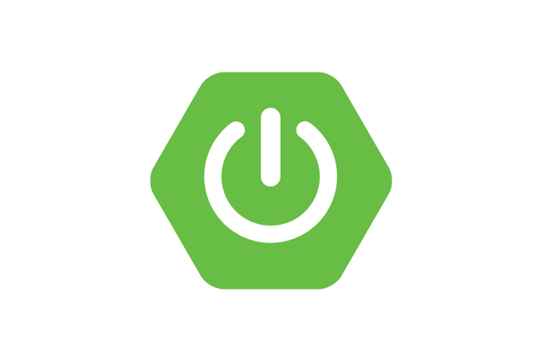
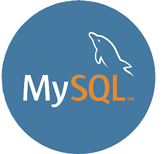

# 💜 Hello, stranger! :)

## A little bit about me:
My name is Yasmim Sabrina. I'm a back-end developer, and I'm majoring in Systems Analysis and Development. I've been studying technology for a little over a year now. In my free time, what I love doing the most is reading and traveling.

## 🚀 My Skills

- 🔥 My main language is Java.
- 🌱 Currently, I'm learning Python.
- ☁️ AWS certified as a cloud practitioner.

  
  

    
    
    
    
    
    
    

## You can reach me at:

 
   
   

