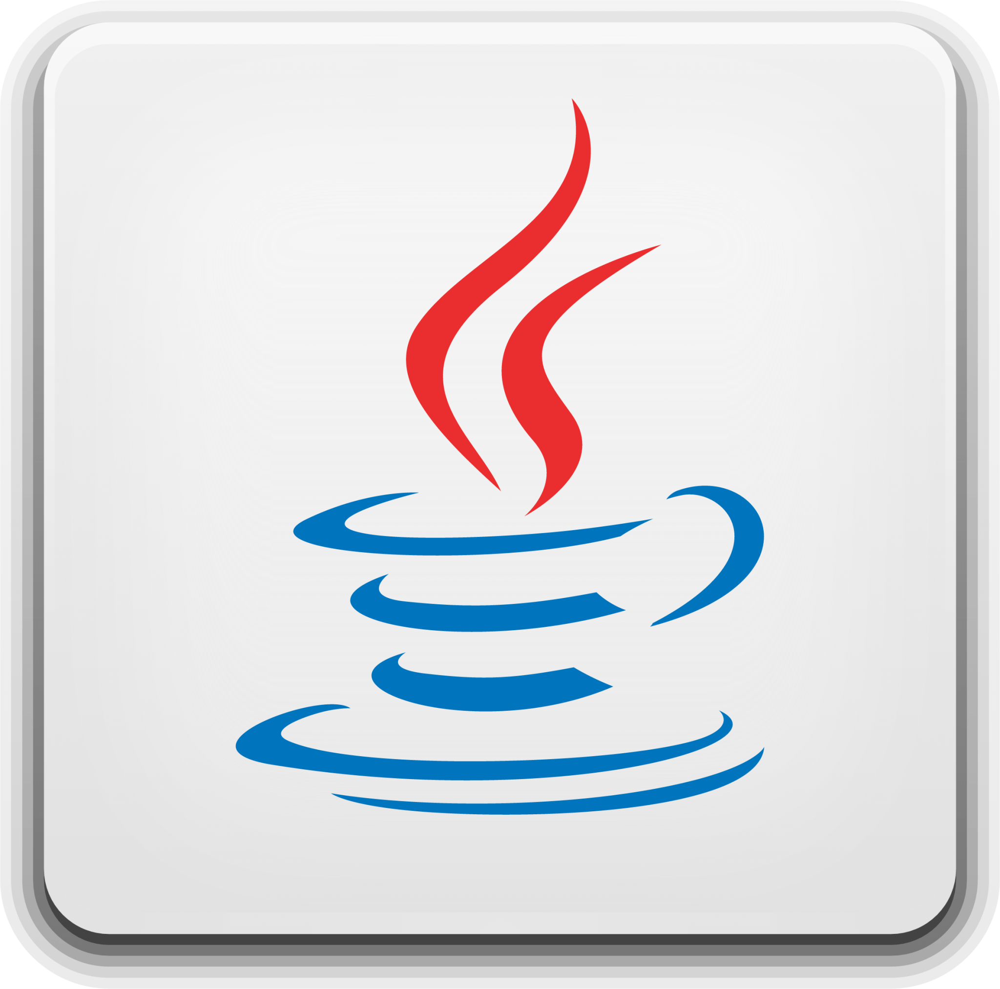

## 💜 Olá!

### Um pouco mais sobre mim :
Meu nome é Yasmim, tenho 20 anos e sou estudante de análise e desenvolvimento de sistemas.

## 🚀 Minhas Skills
- 🔥 Minha linguagem principal é Java.
- 🌱 Atualmente estou aprendendo Python.
- ☁️ Certicada AWS como cloud practitioner.

  
  

    
    
    
    
    
    
    

